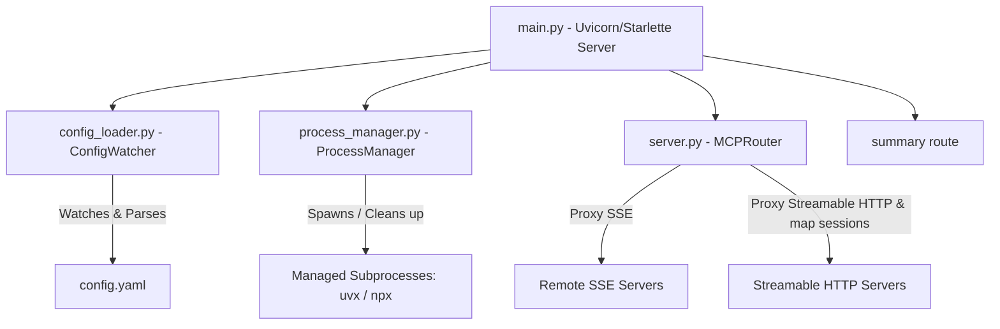

# 🔀 MCP Mux

> **Dynamic Multi-Endpoint Python Model Context Protocol (MCP) Router & Orchestrator**

`mcp-mux` is a dynamic MCP server orchestrator and multiplexer. It acts as a central proxy to multiple remote and local sub-MCP servers, monitoring a `config.yaml` file to hot-reload endpoints live without server restarts. It supports Server-Sent Events (SSE) and Streamable HTTP backend transports, including a local SSE bridge for clients that need an SSE endpoint while the upstream server speaks Streamable HTTP. It also provides a lightweight `/summary` endpoint to minimize context token flooding for AI agents.

---

## 🌟 Key Features

- 🔄 **Dynamic Hot-Reloading**: Uses an asynchronous config watcher to poll configuration changes and dynamically register or unregister server endpoints on the fly.
- 🚀 **Flexible Sub-Server Modes**:
  - **Remote**: Seamless proxying to external HTTP MCP endpoints.
  - **Managed CLI**: Native spawning of command-line tools (e.g., via `npx` or `uvx`).
- 🧩 **Configurable Request Headers**: Adds endpoint-specific upstream headers, including tokens loaded from environment variables.
- 🌉 **Optional Local SSE-to-Streamable-HTTP Bridge**: Streamable HTTP endpoints are proxied as Streamable HTTP by default. Endpoints can opt into a legacy SSE compatibility bridge when traditional SSE clients need a local `event: endpoint` flow.
- ⚡ **Automatic Transport Auto-Detection**: Dynamically detects the backend transport mode (`streamable-http` vs `sse`) based on URL paths. Sub-servers with `/mcp` or `/mcp/` in their URL automatically default to `streamable-http`.
- 🛡️ **Session Propagation & Isolation**: For opt-in legacy bridge sessions, tracks local sessions per endpoint, maps upstream `Mcp-Session-Id` values to the correct local session, and rejects cross-endpoint session reuse.
- 🤝 **Streamable HTTP Client Compatibility**: Normalizes upstream `Accept` headers for Streamable HTTP POST/DELETE requests and fills in missing JSON-RPC `"jsonrpc": "2.0"` fields for request bodies that otherwise look like JSON-RPC messages.
- 🧼 **Decoded Response Header Safety**: Strips stale `Content-Encoding` and upstream `Content-Length` headers when the router reads and rebuilds JSON responses.
- 📊 **Token-Saving Metadata Endpoint**: Registers a custom `/summary` route returning only namespaces and descriptions, shielding AI clients from schema bloat.
- 🧹 **Clean Subprocess Lifecycle**: The manager isolates background subprocesses inside unique Unix process groups (`os.setsid`) to guarantee no zombie processes are left behind on teardown.

---

## 📐 Architecture



Normative refactor contracts are maintained in:

- `docs/architecture/ADR-001-endpoint-gateway.md` — source-derived architecture and target endpoint boundary;
- `docs/compatibility-matrix.md` — current/target/legacy claims and named compatibility scenarios;
- `docs/validation.md` — deterministic CI/local-assessment authority and evidence contract.

These files, together with the governing GitHub issues, supersede historical README prose when a refactor contract is more specific.

---

## ⚙️ Configuration (`config.yaml`)

Define your endpoints in `mcp_router/config.yaml`. Here is an example layout:

```yaml
endpoints:
  - path: "web-search"
    mode: "remote"
    url: "https://mcp.garion.us/mcp"
    summary: "Google Search and content extraction tool"
    # transport: "streamable-http"  (Automatically detected due to /mcp path suffix)
    allowed_tools:
      - "google_search"
      - "batch_extract_urls"

  - path: "firecrawl"
    mode: "managed_cli"
    command: "export NVM_DIR=$HOME/.config/nvm && [ -s $NVM_DIR/nvm.sh ] && . $NVM_DIR/nvm.sh && HTTP_STREAMABLE_SERVER=true PORT=3033 HOST=localhost FIRECRAWL_API_URL=http://garion.us:3002 npx --yes firecrawl-mcp"
    url: "http://localhost:3033/mcp"
    summary: "Firecrawl Web Content Extraction Tool"
    timeout: 300  # Automatically shuts down after 300 seconds of inactivity
    allowed_tools:
      - "firecrawl_search"
      - "firecrawl_scrape"

  - path: "huggingface"
    mode: "remote"
    url: "https://huggingface.co/mcp"
    summary: "HuggingFace MCP Server — model search, hub browsing, model download"
    headers:
      Authorization: "Bearer ${HF_TOKEN:-}"
```

### Environment Variable Expansion

Configuration values support shell-style environment references before validation:

- `${NAME}` expands to the required environment variable `NAME` and fails config loading if it is missing.
- `${NAME:-fallback}` expands to `NAME` when set, otherwise to `fallback`.
- Empty `Authorization: "Bearer ${HF_TOKEN:-}"` values are omitted, allowing endpoints such as Hugging Face to fall back to anonymous access.
- If `HF_TOKEN` is accidentally set to `Bearer hf_...`, the loader normalizes `Bearer Bearer hf_...` to `Bearer hf_...`.

### Configuration Parameters

| Parameter | Type | Required | Description |
|---|---|---|---|
| `path` | String | Yes | Unique namespace/route for the sub-server. |
| `mode` | String | Yes | Spawning mode. `remote` and `managed_cli` are currently handled by the router. |
| `url` | String | Yes (for remote/managed) | Target endpoint URL. |
| `command` | String | Yes (for managed) | Command string to spawn the local server process. |
| `summary` | String | Yes | Brief description of the sub-server, returned by `/summary`. |
| `timeout` | Integer | No | Inactivity timeout in seconds for CLI mode (defaults to 300). |
| `transport` | String | No | Transport mode (`sse` or `streamable-http`). Automatically detected if omitted. |
| `legacy_sse_bridge` | Boolean | No | For `streamable-http` endpoints only. Defaults to `false`; set to `true` to expose the local legacy SSE bridge instead of preserving upstream GET+SSE behavior. |
| `headers` | Mapping | No | Extra request headers forwarded upstream after environment expansion. |
| `allowed_tools` | List of Strings | No | Allowlist of tool names. Only these tools are exposed. |
| `denied_tools` | List of Strings | No | Denylist of tool names. These tools are excluded. (Ignored if `allowed_tools` is set). |

### Streamable HTTP Bridge Behavior

For `streamable-http` endpoints, the mux preserves the original transport by default:

- `POST /<path>` forwards JSON-RPC messages to the upstream MCP endpoint.
- `GET /<path>` with `Accept: text/event-stream` forwards to the upstream MCP endpoint and preserves the upstream response status and stream.

To expose the legacy local SSE bridge, set `legacy_sse_bridge: true` on that endpoint. SSE clients can then connect with:

```bash
curl -N -H 'Accept: text/event-stream' http://127.0.0.1:8012/huggingface
```

The first SSE event contains a local POST endpoint such as:

```text
event: endpoint
data: /huggingface?session_id=<local-session-id>
```

Client POSTs to that local URL are forwarded upstream. If the upstream returns `Mcp-Session-Id`, the router stores it on the local bridge session and forwards it on later POSTs for the same endpoint. Sessions are removed when the local SSE stream closes or when their endpoint is removed or changed during config reload.

---

## 🚀 Getting Started

### Prerequisites
Make sure you have [uv](https://github.com/astral-sh/uv) installed.

### 1. Installation & Setup

Clone the repository and install all dependencies:
```bash
# Activate virtual environment
source .venv/bin/activate

# Install & sync dependencies
uv sync
```

### 2. Running the Orchestrator

Start the main router server (default port is `8012`):
```bash
export HF_TOKEN=hf_xxx  # optional; omit for anonymous Hugging Face access
uv run python main.py --port 8012
```

### 3. Querying Endpoint Summary
You can check active routes and summaries by visiting:
```bash
curl http://127.0.0.1:8012/summary
```

---

## 🧪 Testing

The project is fully tested using `pytest` and `pytest-asyncio`. To execute unit tests:

```bash
uv run pytest
```

Validation authority and exact commands are documented in `docs/validation.md`. Use current exact-head CI/runner evidence rather than a hard-coded historical pass count.
