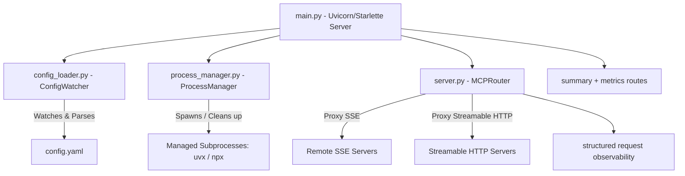

# 🔀 MCP Mux

> **Dynamic Multi-Endpoint Python Model Context Protocol (MCP) Router & Orchestrator**

`mcp-mux` is a dynamic MCP server orchestrator and multiplexer. It acts as a central proxy to multiple remote and local sub-MCP servers, monitoring a `config.yaml` file to hot-reload endpoints live without server restarts. It supports Server-Sent Events (SSE) and Streamable HTTP backend transports, including a local SSE bridge for clients that need an SSE endpoint while the upstream server speaks Streamable HTTP. It also provides a lightweight `/summary` endpoint to minimize context token flooding for AI agents.

---

## 🌟 Key Features

- 🔄 **Dynamic Hot-Reloading**: Uses an asynchronous config watcher to poll configuration changes and dynamically register or unregister server endpoints on the fly.
- 🚀 **Flexible Sub-Server Modes**:
  - **Remote**: Seamless proxying to external HTTP MCP endpoints.
  - **Managed CLI**: Native spawning of command-line tools (e.g., via `npx` or `uvx`).
- 🧩 **Configurable Request Headers**: Adds endpoint-specific upstream headers, including tokens loaded from environment variables.
- 🌉 **Deprecated, Bounded Local SSE Compatibility Adapter**: Streamable HTTP endpoints stay on the canonical transport by default. An endpoint may explicitly opt into the legacy local `event: endpoint` flow with bounded queue, backpressure, TTL, and session-count policy.
- ⚡ **Automatic Transport Auto-Detection**: Dynamically detects the backend transport mode (`streamable-http` vs `sse`) based on URL paths. Sub-servers with `/mcp` or `/mcp/` in their URL automatically default to `streamable-http`.
- 🛡️ **Session Propagation & Isolation**: For explicitly enabled legacy bridge sessions, maps upstream `Mcp-Session-Id` values to endpoint-owned local sessions, rejects cross-endpoint reuse, and deterministically cleans up expired/disconnected sessions and owned upstream work.
- 🤝 **Strict Streamable HTTP Compatibility**: Normalizes required upstream transport headers, rejects malformed JSON-RPC and modern protocol/header mismatches rather than repairing invalid request bodies, and contains invalid-UTF-8, syntactically malformed, or non-standard-constant upstream JSON responses as gateway errors instead of repairing or forwarding invalid MCP payloads. Post-header upstream read failures are also counted and contained before forwarding when the response is still bufferable.
- 🧼 **Decoded Response Header Safety**: Strips stale `Content-Encoding` and upstream `Content-Length` headers when the router reads and rebuilds JSON responses.
- 📊 **Operational Visibility**: `/summary` exposes endpoint descriptions plus runtime/counter state, while `/metrics` provides focused endpoint state, lease, restart, confirmed downstream stream-disconnect, policy-denial, upstream-error, and legacy-bridge counters. The `summary` and `metrics` endpoint namespaces are reserved for these gateway-owned routes.
- 🔎 **Structured Request Diagnostics**: Payload-free JSON logs include request ID, endpoint, protocol revision, method, named capability, result status, duration, bytes streamed, policy outcome, and cancellation state. Actual downstream disconnects are detected at the ASGI receive/send boundary across both pre-2.4 `http.disconnect` and ASGI 2.4+ failed-send semantics; generic task cancellation does not inflate the stream-disconnect counter. `X-Request-Id` is returned downstream, including framework-generated HTTP 500 responses, and supported W3C trace context is propagated upstream without logging raw trace values.
- 🧹 **Clean Subprocess Lifecycle**: The manager isolates background subprocesses inside unique Unix process groups (`os.setsid`) to guarantee no zombie processes are left behind on teardown.

---

## 📐 Architecture



Normative refactor contracts are maintained in:

- `docs/architecture/ADR-001-endpoint-gateway.md` — source-derived architecture and target endpoint boundary;
- `docs/compatibility-matrix.md` — current/target/legacy claims and named compatibility scenarios;
- `docs/validation.md` — deterministic CI/local-assessment authority and evidence contract;
- `docs/configuration.md` — validated endpoint schema and migration contract;
- `docs/threat-model.md` — security assets, trust boundaries, controls, and residual risk;
- `docs/deployment-hardening.md` — production exposure, secret, process, and validation guidance;
- `docs/migration-v0.1-to-v0.2.md` — complete intentional breaking-change checklist for v0.2.0;
- `docs/release-notes-v0.2.0.md` — release scope and evidence boundary.

These files, together with the governing GitHub issues, supersede historical README prose when a refactor contract is more specific.

---

## ⚙️ Configuration (`config.yaml`)

Define your endpoints in `mcp_router/config.yaml`. Here is an example layout:

```yaml
endpoints:
  - path: "web-search"
    mode: "remote"
    url: "https://mcp.garion.us/mcp"
    summary: "Google Search and content extraction tool"
    # transport: "streamable-http"  (Automatically detected due to /mcp path suffix)
    allowed_tools:
      - "google_search"
      - "batch_extract_urls"

  - path: "firecrawl"
    mode: "managed_cli"
    unsafe_shell_command: "export NVM_DIR=$HOME/.config/nvm && [ -s $NVM_DIR/nvm.sh ] && . $NVM_DIR/nvm.sh && npx --yes firecrawl-mcp"
    env:
      HTTP_STREAMABLE_SERVER: "true"
      PORT: "3033"
      HOST: "localhost"
      FIRECRAWL_API_URL: "http://garion.us:3002"
    readiness:
      host: "localhost"
      port: 3033
    url: "http://localhost:3033/mcp"
    summary: "Firecrawl Web Content Extraction Tool"
    timeout: 300  # Automatically shuts down after 300 seconds of inactivity
    allowed_tools:
      - "firecrawl_search"
      - "firecrawl_scrape"

  - path: "huggingface"
    mode: "remote"
    url: "https://huggingface.co/mcp"
    summary: "HuggingFace MCP Server — model search, hub browsing, model download"
    headers:
      Authorization: "Bearer ${HF_TOKEN:-}"
```

### Environment Variable Expansion

Configuration values support shell-style environment references before validation:

- `${NAME}` expands to the required environment variable `NAME` and fails config loading if it is missing.
- `${NAME:-fallback}` expands to `NAME` when set, otherwise to `fallback`.
- Empty `Authorization: "Bearer ${HF_TOKEN:-}"` values are omitted, allowing endpoints such as Hugging Face to fall back to anonymous access.
- If `HF_TOKEN` is accidentally set to `Bearer hf_...`, the loader normalizes `Bearer Bearer hf_...` to `Bearer hf_...`.

### Configuration Parameters

| Parameter | Type | Required | Description |
|---|---|---|---|
| `path` | String | Yes | Unique namespace/route for the sub-server. `summary` and `metrics` are reserved case-insensitively for gateway-owned operational routes. |
| `mode` | String | Yes | Spawning mode. `remote` and `managed_cli` are currently handled by the router. |
| `url` | String | Yes (for remote/managed) | Target endpoint URL. |
| `argv` | List of Strings | One of `argv` / `unsafe_shell_command` (managed) | Preferred managed-process command; executed directly without a shell. |
| `env` | Mapping | No | Environment variables added to a managed process. |
| `cwd` | String | No | Working directory for a managed process. |
| `readiness` | Mapping | No | Managed HTTP readiness `host`, `port`, `timeout`, and polling `interval`; host/port default from `url`. |
| `unsafe_shell_command` | String | One of `argv` / `unsafe_shell_command` (managed) | Explicit shell escape hatch for commands that require shell syntax; avoid when structured `argv` is sufficient. |
| `summary` | String | Yes | Brief description of the sub-server, returned by `/summary`. |
| `timeout` | Integer | No | Inactivity timeout in seconds for CLI mode (defaults to 300). |
| `transport` | String | No | Transport mode (`sse` or `streamable-http`). Automatically detected if omitted. |
| `legacy_sse_bridge` | Mapping | No | Deprecated compatibility adapter for `streamable-http` endpoints only. Omit to disable. When present, configures `queue_capacity`, `backpressure_timeout`, `session_ttl`, and `max_sessions`. |
| `headers` | Mapping | No | Extra request headers forwarded upstream after environment expansion. |
| `allowed_tools` | List of Strings | No | Allowlist of tool names. Only these tools are exposed. |
| `denied_tools` | List of Strings | No | Denylist of tool names. Mutually exclusive with `allowed_tools`; configuring both is rejected. |

### Streamable HTTP Bridge Behavior

For `streamable-http` endpoints, the mux preserves the original transport by default:

- `POST /<path>` forwards JSON-RPC messages to the upstream MCP endpoint.
- `GET /<path>` with `Accept: text/event-stream` forwards to the upstream MCP endpoint and preserves the upstream response status and stream.

The local SSE adapter is deprecated and disabled unless an endpoint supplies an explicit bounded mapping, for example:

```yaml
legacy_sse_bridge:
  queue_capacity: 32
  backpressure_timeout: 1.0
  session_ttl: 300.0
  max_sessions: 32
```

An explicitly configured legacy SSE client can then connect with:

```bash
curl -N -H 'Accept: text/event-stream' http://127.0.0.1:8012/huggingface
```

The first SSE event contains a local POST endpoint such as:

```text
event: endpoint
data: /huggingface?session_id=<local-session-id>
```

Client POSTs to that local URL are forwarded upstream. If the upstream returns `Mcp-Session-Id`, the adapter stores it on the endpoint-owned local session and forwards it on later POSTs for that endpoint. Sessions are removed on disconnect, TTL expiry, endpoint retirement/configuration change, backpressure failure, or application shutdown. Excess sessions are rejected, asynchronous bridge failures are surfaced as terminal SSE error events, and `/summary` reports active-session and failure counters to support a future evidence-based removal decision.

`stdio_bridge` is intentionally unsupported: configuration accepts only `remote` and `managed_cli`. A stdio mode must remain rejected until a complete end-to-end adapter is implemented through the shared runtime/policy boundary.

---

## 🚀 Getting Started

### Prerequisites
Make sure you have [uv](https://github.com/astral-sh/uv) installed.

### 1. Installation & Setup

Clone the repository and install all dependencies:
```bash
# Activate virtual environment
source .venv/bin/activate

# Install & sync dependencies
uv sync
```

### 2. Running the Orchestrator

Start the main router server (default port is `8012`):
```bash
export HF_TOKEN=hf_xxx  # optional; omit for anonymous Hugging Face access
uv run python main.py --port 8012
```

### 3. Querying Endpoint Summary
You can check active routes and summaries by visiting:
```bash
curl http://127.0.0.1:8012/summary
```

---

## 🧪 Testing

The project uses focused configuration, protocol, policy, proxy, streaming, process, reload, security, compatibility, and lifecycle suites. To execute the complete local test corpus:

```bash
uv run pytest
```

Validation authority and exact commands are documented in `docs/validation.md`. Pull requests are expected to pass Python 3.13/3.14 quality, unit, and integration jobs plus dependency audit and official MCP `2026-07-28` conformance. Use current exact-head CI/runner evidence rather than a hard-coded historical pass count.
